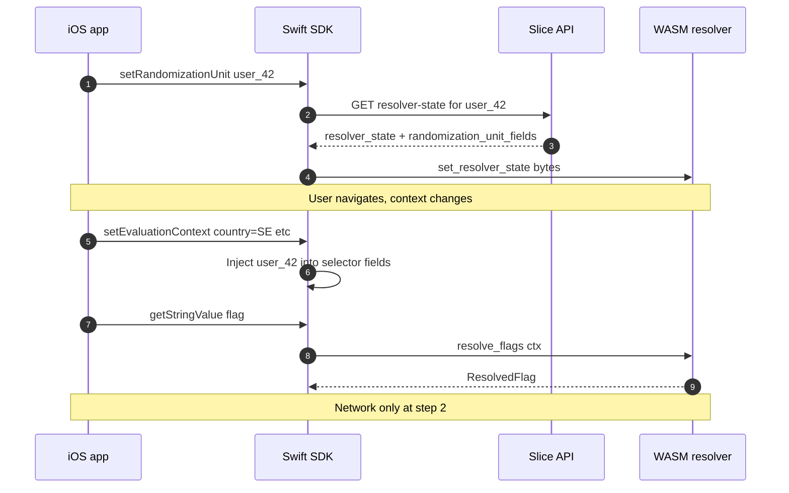

# Unit-Local Resolver (RFC / proposal)

**Status:** draft for discussion — prototype validated end-to-end on iOS simulator · **Owner:** Fabrizio Demaria · **Date:** May 2026

A hybrid between the **online resolver** (remote evaluation) and the
**fully-local WASM resolver** (`confidence-resolver`), for clients that
operate on behalf of a **single fixed entity** but resolve flags
against many different evaluation contexts over time.

## TL;DR

For a fixed `user_id`, the WASM resolver can be served a **per-user state
slice** that omits the population bitsets (which dominate state size). A
prototype slicer rewrites a full `ResolverState` into a slice that the
**unmodified resolver** accepts — on the bundled fixture, **~2% of original
size** (246 KB → ~5 KB) with bit-identical resolve results. The full
loop — Rust slice server, Swift package wrapping the WASM resolver via
**WasmKit**, a self-contained `OpenFeature.FeatureProvider`, and a
SwiftUI demo app on the iOS simulator — has also been demonstrated
end-to-end. Everything lives on a single
[`unit-local`](https://github.com/spotify/confidence-resolver/tree/unit-local)
branch (see [Branches and code references](#branches-and-code-references));
no modifications to the existing
[`spotify/confidence-sdk-swift`](https://github.com/spotify/confidence-sdk-swift)
are required.

## Problem

The WASM resolver ships the full account state to every client. State
size is dominated by **one 1M-bit population bitset per segment**.

For clients that operate on behalf of a **single fixed entity** — most
notably the **Confidence mobile SDKs**
([`spotify/confidence-sdk-swift`](https://github.com/spotify/confidence-sdk-swift)),
where `targetingKey` is set once per session but the rest of the
evaluation context churns as the user navigates — shipping the full
bitsets is wasteful, while staying online is high-latency, breaks
offline, and surfaces `STALE`.

## Idea: per-user state slicing

Unit identity enters resolution in exactly **two** places:

1. **Population check** — `bitset[hash("MegaSalt-{accountId}|{unit}") % 1_000_000]`
2. **Variant bucketing** — `hash("{segmentId}|{unit}") % bucket_count` → find
   the assignment whose `bucket_ranges` cover that bucket

For a fixed `unit`, both collapse to a single deterministic answer per
segment / rule, knowable at slice time.

### Slicing recipe

- **Population bitsets**: lookup the unit's bucket. If set → rewrite to
  `full_bitset: true` (resolver fast path bypasses the check). If clear →
  gzipped 1M-bit all-zero bitset (~140 bytes).
- **Variant assignments**: lookup the unit's variant bucket, find the
  covering assignment, rewrite its range to `[0, bucket_count)`. Whatever
  bucket the resolver hashes to lands on the right variant.

Everything else is untouched; the resolver never knows it's running on a
slice.

## Prototype and validation

Slicer: [`confidence-resolver/src/slicer.rs`](confidence-resolver/src/slicer.rs)
— public API `slice_for_unit(state, account_id, unit) -> ResolverState`.
No protobuf changes, no WASM entry-point changes, no resolver-core changes.

Integration test:
[`confidence-resolver/tests/per_user_slice.rs`](confidence-resolver/tests/per_user_slice.rs).
4 pinned units × 4 evaluation contexts, resolved against both the full
state and the slice; non-deterministic fields stripped before comparison.

```text
per-user slicer parity test
  fixture: resolver_state.pb (245622 bytes)
  unit=tutorial_visitor   sliced=   5093 bytes ( 2.07% of original)
  unit=user_42            sliced=   4935 bytes ( 2.01% of original)
  unit=alice              sliced=   5093 bytes ( 2.07% of original)
  unit=bob_12345          sliced=   5093 bytes ( 2.07% of original)
test slice_preserves_resolve_results ... ok
```

- **Identical resolve results** across all 16 (unit × context) pairs.
- **~50× size reduction** on this fixture; savings scale with segment count.

The slicer's math is selector-agnostic. The prototype also ships a
defensive consistency check that aborts on multi-selector accounts; with
the SDK API in §B item 5, that check is no longer load-bearing — see open
question #5.

### End-to-end validation on iOS

Beyond the slicer parity test, the full loop is now wired up locally on
a single `unit-local` branch in this repo (see
[Branches and code references](#branches-and-code-references)). All
five pieces live next to each other under `openfeature-provider/swift/`:

- **Slice server** (`unit-local-server/`, Rust + axum) — exposes
  `/v1/account-config`, `/v1/resolver-state/{stateHash}/{unit}`, and
  `/v1/apply` from a bundled fixture by invoking
  `slicer::slice_for_unit` per request.
- **WASM runtime + `wasm-msg` host** (`ConfidenceLocalResolver` target,
  Swift) — wraps `confidence_resolver.wasm` via **WasmKit** (pure-Swift
  WASM runtime, iOS 16+), ports the `wasm-msg` allocator + protobuf
  envelopes to Swift, plus a typed `LocalResolver` and a `SliceClient`.
- **OpenFeature provider** (`ConfidenceLocalProvider` target, Swift) —
  ~350 LoC implementing `OpenFeature.FeatureProvider` directly on top of
  `LocalResolver` and `SliceClient`. Owns its own flag cache, refetches
  the slice on randomization-unit changes, drills into struct flag
  values, and POSTs apply events back to `/v1/apply` (closing open
  question #6). Mirrors the role of the Java provider
  ([`OpenFeatureLocalResolveProvider.java`](openfeature-provider/java/src/main/java/com/spotify/confidence/sdk/OpenFeatureLocalResolveProvider.java))
  — no dependency on the existing `Confidence` Swift SDK at all.
- **Codegen** — a small `ConfidenceProtoGen` SwiftPM build-tool plugin
  invokes `protoc` + `protoc-gen-swift` at build time against the same
  `openfeature-provider/proto/` directory the other providers consume.
  No vendored `.pb.swift` (the protos are accessed via a symlink under
  the target source dir).
- **Demo app** — `DemoApp/`, a hand-rolled single-screen SwiftUI iOS
  project that bootstraps `ConfidenceLocalProvider`, registers it via
  `OpenFeatureAPI.shared.setProviderAndWait(...)`, and renders the
  resolution result. On the iPhone 17 Pro simulator,
  `fallthrough-test-1.enabled` resolves to `true` with reason `MATCH`;
  slice on the wire for `user_42` is **4,935 / 245,717 B ≈ 2%**, matching
  the parity test. Apply round-trips: the server logs the
  `ApplyFlagsRequest` immediately after each resolve.

A few concrete findings beyond what the slicer-only prototype could show:

- **No SDK changes needed at all.** Earlier iterations injected a custom
  `ConfidenceResolveClient` into the existing
  [`spotify/confidence-sdk-swift`](https://github.com/spotify/confidence-sdk-swift);
  in the consolidated shape the unit-local provider is just *another
  OpenFeature provider*, registered via the standard
  `OpenFeatureAPI.shared.setProvider(...)`. Mirrors the pattern used by
  every other language in this monorepo and avoids a second branch in a
  second repo. The Swift SDK keeps doing its thing for customers who
  want the existing online flow.
- **Platform cost is real.** WasmKit lifts the package's minimum to
  **iOS 16 / macOS 14**. Apple has no first-party iOS WASM runtime
  today; WasmKit is the only credible pure-Swift, SPM-friendly option
  found. Wasmer / Wasmtime have no iOS targets.
- **Build-time proto gen works, but is fiddly on iOS.** The official
  `SwiftProtobufPlugin` doesn't handle our case: two protos
  (`flags/resolver/v1/types.proto` and `flags/types/v1/types.proto`)
  share a basename, which collides at the `.o` stage; the plugin's
  `FileNaming=PathToUnderscores` support is broken (it pre-declares
  outputs at paths protoc doesn't write to). A 90-LoC custom plugin
  using `Command.buildCommand` with explicit `outputFiles` works
  cleanly in both `swift build` and Xcode. Java/Go don't hit this
  because their codegen is package-aware.
- **Swift 6 concurrency was easy.** An `NSLock` approach got compiler
  warnings about use from async contexts; converting the lock-protected
  mutations into small sync helper methods called from the async paths
  silences them without any actor refactor.

## What it would take to ship this

Two new pieces, plus the existing slicer: a server endpoint that serves
per-user slices, and a WASM-enabled iOS SDK that consumes them.

### A. Server: per-user state endpoint

New endpoint accepting `(client_secret, unit)` and returning a serialized
sliced `ResolverState`. Natural home: the existing online resolver
service, which already caches the full account state in memory. The
slicer is implemented in Rust (see [`slicer.rs`](confidence-resolver/src/slicer.rs))
and can either be re-implemented in the host language or invoked as the
Rust WASM.

Reuse existing `client_secret` auth. Cache on
`(account, stateFileHash, unit)`; `stateFileHash` invalidates naturally on
admin state changes.

### B. Client: WASM-enabled iOS provider

Packaged as a standalone OpenFeature provider in
[`openfeature-provider/swift/`](openfeature-provider/swift/), parallel to
the Java / Go / JS / Python / Ruby providers. Items 1–4 have been
prototyped on the
[`unit-local` branch](https://github.com/spotify/confidence-resolver/tree/unit-local)
and exercised end-to-end on the simulator (see
[End-to-end validation on iOS](#end-to-end-validation-on-ios) above);
items 5–6 remain design-stage.

1. **WASM runtime** — embed e.g. **WasmKit** (pure Swift, Apple-backed).
2. **WASM binary distribution** — bundle as an SPM resource; rely on
   `wasm-msg`'s host↔guest version handshake. (`confidence_resolver.wasm`
   is ~470 KB committed.)
3. **Host bridge** — implement the two host imports
   (`wasm_msg_host_log_message` → `os_log`,
   `wasm_msg_host_current_time` → `Date()`).
4. **Message layer + OpenFeature surface** — port the `wasm-msg`
   allocator + protobuf round-trip to Swift (`SwiftProtobuf`), and wrap
   it in an `OpenFeature.FeatureProvider`. Reference:
   [`OpenFeatureLocalResolveProvider.java`](openfeature-provider/java/src/main/java/com/spotify/confidence/sdk/OpenFeatureLocalResolveProvider.java).
5. **New SDK API: explicit randomization unit.** Unit-local mode
   introduces a cost asymmetry today's API hides — identity change costs
   network, anything else is local-only. Conflating both inside
   `setEvaluationContext` would be a footgun. Proposal:

   ```swift
   confidence.setRandomizationUnit("user_42")   // triggers slice fetch
   confidence.setEvaluationContext(...)         // local-only, no network
   ```

   `setRandomizationUnit` takes a **value only**. The field name(s) the
   value should land in at resolve time travel to the SDK as slice
   response metadata (`randomization_unit_fields: ["visitor_id"]`); the
   SDK auto-injects the value into every listed field before each
   resolve. Multi-selector accounts are handled transparently; app code
   stays unaware of which field name(s) the portal happens to use. Keep
   the online path as a configurable fallback.

6. **Cache invalidation** — slice bytes carry `state_file_hash`; SDK
   refetches only when it changes.

Resolution flow with the new API:



### C. Performance and caching

Slices are computed **on the fly** — per-user fan-out makes upfront
pre-computation impractical.

Cost per slice with account state warm in memory: ~500 segments ×
(murmur3 + modulo + bit lookup), plus an assignment rewrite per rule and a
sub-ms protobuf encode → **sub-millisecond total**.

Recommended shape: **API endpoint + CDN edge cache**, with
`state_file_hash` baked into the URL
(`GET /v1/resolver-state/{accountHash}/{stateFileHash}/{unitHash}`). First
request: CDN miss → origin computes → edge caches. State change: new
hash → new URL → old slices age out without explicit purge.

### Effort estimate (rough)

| Piece | Estimate |
|---|---|
| Server slice endpoint + caching | 1–2 weeks |
| Swift WASM host + `wasm-msg` port + local-resolve flow | 2–3 weeks |
| Swift SDK unit-local mode behind a flag, online fallback | 1–2 weeks |
| E2E QA on iOS (offline, context churn, refresh) | 1 week |
| **Total** | **~5–8 weeks** for a behind-flag beta |

Android would follow the same pattern with Chicory or similar.

## Open questions for the team

1. **Where should the slicer run?** New endpoint on the existing online
   resolver service (already has account state in memory)? A new
   dedicated service? Inside the client (fetch full state once, re-slice
   locally per user)?
2. **Privacy / trust boundary.** For the target Swift SDK migration this
   is a **net win**: the server sees `user_id` once at slice time instead
   of on every resolve, as it does today. Compared to the fully-local
   providers (JS / Java / Go / Python) it's a regression, but those
   aren't viable on mobile due to state size. Pseudonymisation (hash the
   unit before sending) remains available if customers want stronger
   guarantees — the resolver math is identical.
3. **Per-user proto?** The POC reuses `PackedBitset` so the resolver
   loads slices unchanged. A purpose-built
   `PerUserResolverState { map<segment_name, bool> }` would simplify the
   payload and unlock further size reductions, at the cost of a new WASM
   entry point.
4. **Slice staleness across admin changes.** The slicer bakes the
   user's variant into the rewritten `bucket_ranges`, so admin changes
   to a rule's allocation make existing slices yield the **old** answer
   until the next refresh — same staleness shape as today's full-state
   WASM cache (also keyed by `stateFileHash`). Acceptable for the iOS
   use case: clients refresh on session start, and within-session
   stability is desirable (no flicker from server-side changes that the
   app didn't trigger). Worth noting in docs; not a blocker.
5. **Multi-selector accounts and the slicer's check.** With the SDK API
   in §B item 5, multi-selector accounts work transparently. The slicer's
   consistency check is therefore defensive only — keep it as
   defence-in-depth, or drop it and let the SDK contract be authoritative?
6. **Sticky assignments / materializations.** `read_materialization`
   rules pull per-user records from Bigtable at resolve time; we'd need
   to **prefetch them into the slice** so the local resolver has them.
   Writes are handled via a dedicated `apply` code path that reports
   back to the slice service so the backend can persist the
   materialization as it does today. In the PoC, `ConfidenceLocalProvider`
   POSTs an `ApplyFlagsRequest` to `POST /v1/apply` after each resolve;
   the prototype server just ack-logs it but the wire shape matches the
   existing online apply endpoint, so the productionised version is a
   straightforward forward.

## Branches and code references

All prototype work lives on a single `unit-local` branch in this repo.
No PR opened — it's intended as a readable code diff for the team.

[`spotify/confidence-resolver` — `unit-local`](https://github.com/spotify/confidence-resolver/tree/unit-local)
&nbsp;([compare with `main`](https://github.com/spotify/confidence-resolver/compare/main...unit-local))

| Path | Purpose |
|---|---|
| `confidence-resolver/src/slicer.rs` | `slice_for_unit(state, account_id, unit)` — the core rewriter |
| `confidence-resolver/tests/per_user_slice.rs` | Parity test, 4 units × 4 contexts |
| `unit-local-server/` | Local Rust HTTP slice server (axum) on `127.0.0.1:8787`, `/v1/account-config`, `/v1/resolver-state/{hash}/{unit}`, `/v1/apply` |
| `openfeature-provider/swift/Sources/ConfidenceLocalResolver/` | WasmKit-backed `LocalResolver`, host-side `wasm-msg`, `SliceClient` (incl. `applyFlags`) |
| `openfeature-provider/swift/Sources/ConfidenceLocalProvider/` | `OpenFeature.FeatureProvider` on top of `ConfidenceLocalResolver`; flag cache, unit-change re-slicing, apply round-trip |
| `openfeature-provider/swift/Sources/LocalResolverCli/` | Standalone CLI exercising the lower layer without OpenFeature |
| `openfeature-provider/swift/Plugins/ConfidenceProtoGen/` | SwiftPM build-tool plugin that generates the `.pb.swift` from `openfeature-provider/proto/` at build time |
| `openfeature-provider/swift/DemoApp/` | Single-screen SwiftUI iOS Xcode project that registers `ConfidenceLocalProvider` via `OpenFeatureAPI`. |

## References

- Resolver core (hashing, bucketing): [`confidence-resolver/src/lib.rs`](confidence-resolver/src/lib.rs)
- OpenFeature provider used as the architectural template for the Swift one: [`OpenFeatureLocalResolveProvider.java`](openfeature-provider/java/src/main/java/com/spotify/confidence/sdk/OpenFeatureLocalResolveProvider.java) and its WASM wrapper [`WasmLocalResolver.java`](openfeature-provider/java/src/main/java/com/spotify/confidence/sdk/WasmLocalResolver.java)
- Confidence Swift SDK (unchanged by this experiment): [`spotify/confidence-sdk-swift`](https://github.com/spotify/confidence-sdk-swift)
- WasmKit (Swift WASM runtime): [`swiftwasm/WasmKit`](https://github.com/swiftwasm/WasmKit)
